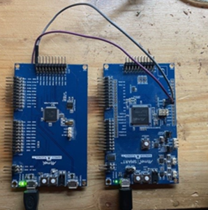
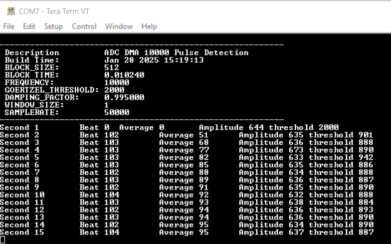
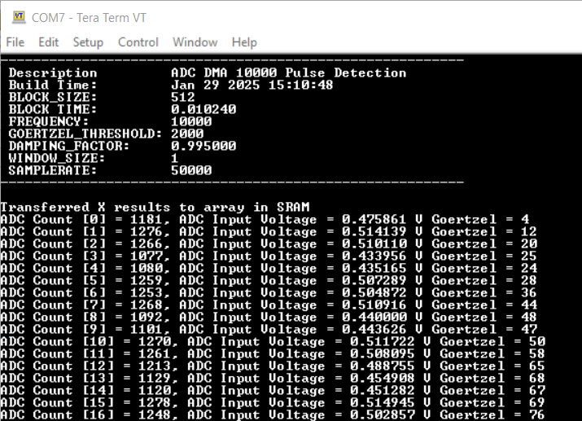
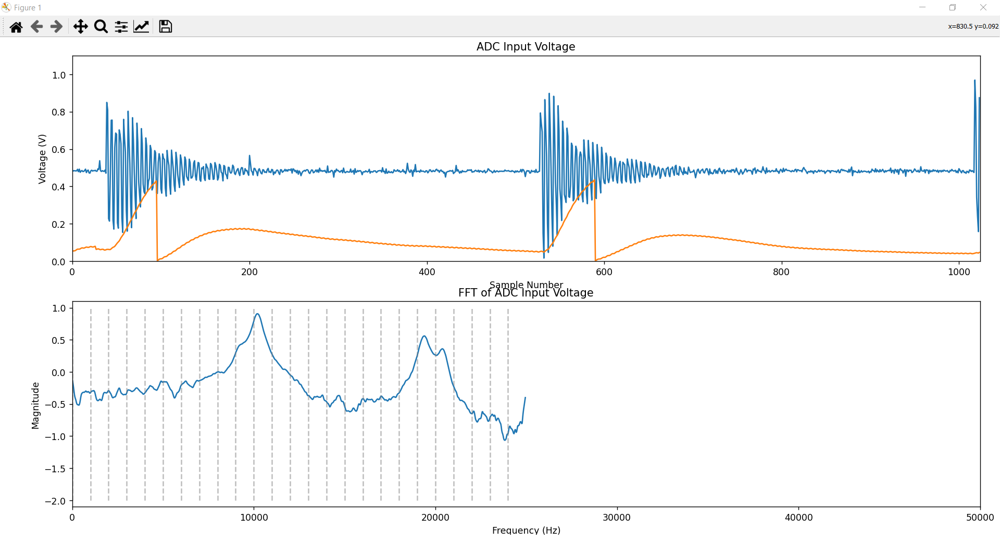
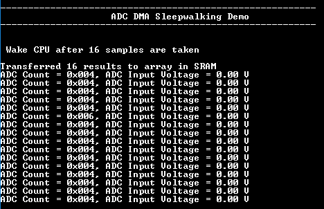

# ADC DMA Double Buffering and Signal Processing

This application shows how to use the TC3/ADC/DMA to collect 2*512 samples (Ping-Pong Buffer) at a samplerate of 50kHz. While one buffer is filled with data, the other buffer is used to work safely with the data. This is an example of a continuesly digital signal processing. 

In this case a Frequency pulse detection is done with a Goertzel algorithm. 

While one board is producing the pulse (you can use the project https://github.com/zabooh/waveform_generator.git to generated the pulse) The other booard is analysing the samples.

[SAM D21 Xplained Pro Evaluation Kit](https://www.microchip.com/developmenttools/ProductDetails/atsamd21-xpro)  and a 
[SAMC21N Xplained Pro Evaluation Kit](https://www.microchip.com/developmenttools/ProductDetails/atsamc21n-xpro) 

## Description

While the TC3/ADC/DMA is collecting one buffer with 512 samples, in the other buffer a Goertzel Algorithm is used to detect a 10kHz frequency. Further processing is used to detect pulses of 10kHz. This pulses are count and once per second the result is print onto the terminal. 

when the macro STREAM_DATA in __main.c__ is defined by deleting the // 

    //#define STREAM_DATA   

the last two buffers of 512 samples and the Goertzel Result is streamed to the Terminal in ASCII.  

This data can be received by the Pyhton Script __disp_adc.py__ to visualize the data in the buffer. Keep in mind, that in STREAM_DATA the data is not continuesly sampled anymore,the sampling at 50kHz into 2*512 Samples achieves a total sample time of 20.48 milli seconds. Then the sampling is paused and the data is streamed to the Terminal. When streaming is ready, it restarts the sampling. 

The blue line is the actual sampled data. this data is put into a Goertzel Algorithm and then the output is out into a simple low pass filter. This is then the red line. 
when the output of the low pass does reached a certain value, the internal values of the Goertzel are reset and this event is counted as a "pulse detection"

the actual Goertzel is implentd here firmware/src/goertzel.c

It is implemented in float and in fixpoint. The float implemantation shows how it works in a clean mathematic way to understand the Goertzel, while the fixpoint implementaion is hand-optimized for better performance.

All Source codes are in plain C and should run on every 32 bit machine with GCC style compiler.  

whith the following macro the float implementaion would be used, but this would overlaod the realtime conditions by approx. factor 6. So this can only be used in STREAM_DATA mode. 
    
    //#define USE_FLOAT_GOERTZEL

If you don#t trust the ADC values for any reason or to check the Signal processing, you can use an artificial signal from an internal wavetable:

    //#define USE_ARTIFICIAL_SIGNAL

Whith the following macro you can choose the threshhold at what level a frequency is detected:

    #define SIGNAL_SCALE_THRESHOLD 1.4

in __firmware/src/goertzel.h__ you'll find some parameters. The most interesting one is FREQUENCY. It defines the "resonance" frequency of the goertzel. 
The function Goertzel_i_Init() allows to calcute the coefficienst during runtime. This allow to reconfigre the Goertzel all the time. 

The  DAMPING_FACTOR  allows to let the Goertzel output go down by otself, otherwise it would accumulate the result allways up.

    // Define constants 
    #define BLOCK_SIZE            512    // Size of the data block to process
    #define SAMPLERATE          50000    // Sampling rate in Hz
    #define FREQUENCY           10000    // Target frequency to detect
    #define GOERTZEL_THRESHOLD   2000    // start threshold for detection
    #define DAMPING_FACTOR      0.995    // Damping factor to prevent overflow
    #define WINDOW_SIZE             1    // Window size for resetting accumulators

## Setting up the hardware

The following table shows the target hardware for the application projects.

| Project Name| Board|
|:---------|:---------:|
| sam_d21_xpro.X | [SAM D21 Xplained Pro Evaluation Kit](https://www.microchip.com/developmenttools/ProductDetails/atsamd21-xpro)
| sam_da1_xpro.X | [SAM DA1 Xplained Pro Evaluation Kit](https://www.microchip.com/DevelopmentTools/ProductDetails/PartNO/ATSAMDA1-XPRO)
|||

### Setting up [SAM D21 Xplained Pro Evaluation Kit](https://www.microchip.com/developmenttools/ProductDetails/atsamd21-xpro)

- Connect a voltage below the selected ADC reference voltage (VDDANA / 2) to pin 3 (PA02 - ADC_AIN0) of EXT3 connector
- Connect the Debug USB port on the board to the computer using a micro USB cable

### Setting up [SAM DA1 Xplained Pro Evaluation Kit](https://www.microchip.com/DevelopmentTools/ProductDetails/PartNO/ATSAMDA1-XPRO)

- Connect a voltage below the selected ADC reference voltage (VDDANA / 2) to pin 3 (PA02 - ADC_AIN0) of EXT3 connector
- Connect the Debug USB port on the board to the computer using a micro USB cable

## Running the Application

1. Open the Terminal application (Ex.:Tera term) on the computer
2. Connect to the EDBG Virtual COM port and configure the serial settings as follows:
    - Baud : 115200
    - Data : 8 Bits
    - Parity : None
    - Stop : 1 Bit
    - Flow Control : None
3. Build and Program the application using its IDE
4. CPU wakes up after every 16 transfers of ADC result and updates the console as shown below:

    

5. Failure is indicated by turning ON the user LED (i.e. application failed if the LED is turned ON)

Refer to the table below for details of LED:

| Board| LED name|
|------|---------|
| [SAM D21 Xplained Pro Evaluation Kit](https://www.microchip.com/developmenttools/ProductDetails/atsamd21-xpro) | LED0 |
| [SAM DA1 Xplained Pro Evaluation Kit](https://www.microchip.com/DevelopmentTools/ProductDetails/PartNO/ATSAMDA1-XPRO) | LED0 |
|||
